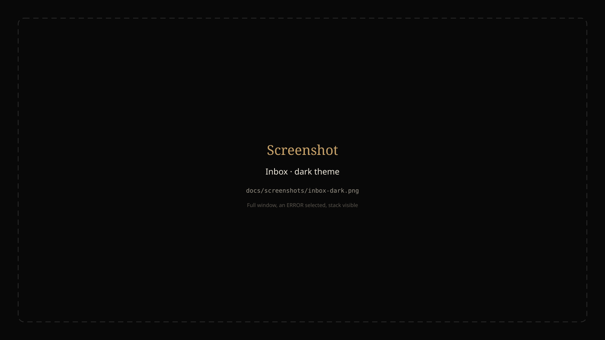
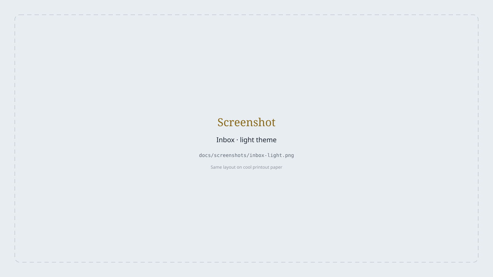
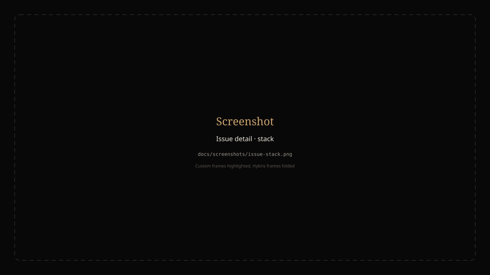
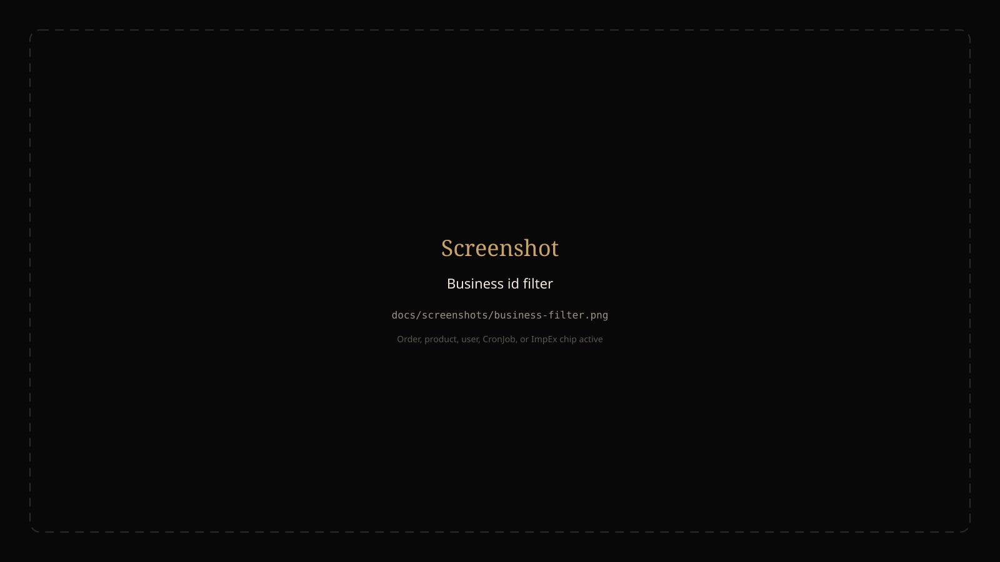
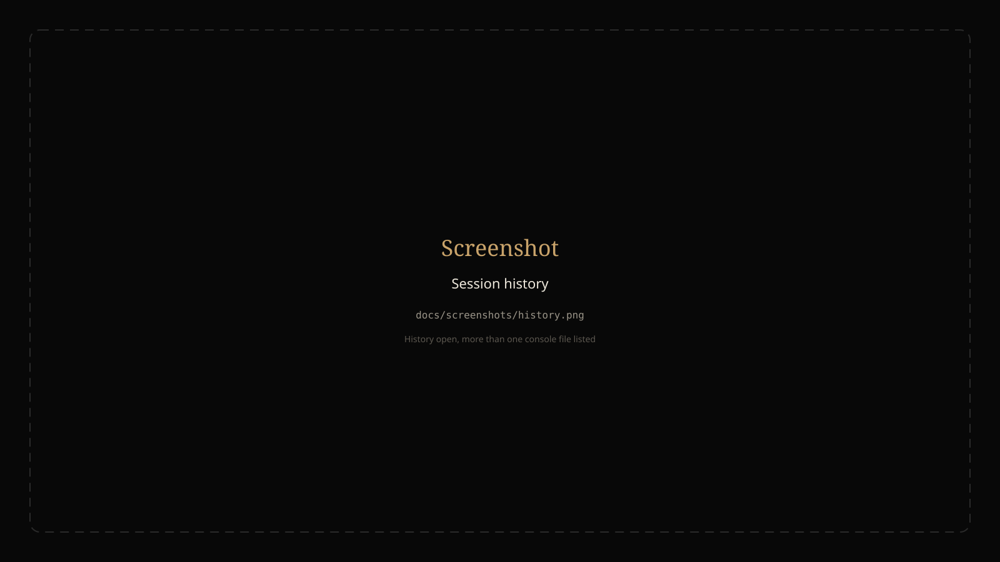

# Commerce Error Radar

Local **ERROR / WARN inbox** for **SAP Commerce (Hybris) + Spring** on Windows.

You start `hybrisserver.bat` or Ant the way you always do. Radar tails the Hybris log that was written last — console, Catalina, wrapper, or `ant.log` — keeps only `ERROR` / `WARN` / `FATAL`, groups repeats by fingerprint, and shows them in a browser UI that does not scroll away with the log.

It is a **local** tool. It never starts or wraps `hybrisserver.bat` or Ant — it only reads the log files.

```text
hybrisserver.bat / ant initialize / ant updatesystem / ant clean all
        │
        ▼
<HYBRIS_HOME>\hybris\log\
        tomcat\console-YYYYMMDD.log
        tomcat\catalina*.log
        tomcat\wrapper.log
        ant.log
        │  tail newest from EOF  (never load a multi-GB file)
        ▼
Spring Boot collector :8088  →  SQLite  →  Angular UI
```

| | |
|---|---|
| Collector | `http://localhost:8088` |
| Swagger UI | `http://localhost:8088/swagger-ui.html` |
| UI (`npm start`) | `http://localhost:4500` |
| UI (`ng serve` / `angular.json`) | `http://localhost:4200` |

The UI proxies `/api` to the collector. Open the port you actually started.

---

## Screenshots

Replace each placeholder SVG with a PNG of the same name (see [`docs/screenshots/README.md`](docs/screenshots/README.md)), then change `.svg` → `.png` in the image links below.

<p align="center">
  
</p>
<p align="center"><sub>Inbox · dark theme · issue selected</sub></p>

<p align="center">
  
</p>
<p align="center"><sub>Inbox · light theme</sub></p>

<p align="center">
  
</p>
<p align="center"><sub>Stack · your package highlighted · Hybris frames folded</sub></p>

<p align="center">
  
</p>
<p align="center"><sub>Filter this session by order, product, user, CronJob, or ImpEx file</sub></p>

<p align="center">
  
</p>
<p align="center"><sub>History · one log file is one session</sub></p>

---

## Why it exists

Hybris logs are huge, noisy, and gone the moment the terminal scrolls. You cannot grep a 4 GB `console-YYYYMMDD.log` every time a CronJob fails, and a Solr ping WARN should not hide the NPE that comes after it. `ant initialize` and `wrapper.log` are the same problem in a different file.

Radar is the night-shift inbox for those files:

- **Live.** Tails from EOF. Polls file length. Does not read the whole log into memory.
- **Grouped.** The same OCC NPE is one issue with a count, not 47 rows.
- **Fingerprinted on your code.** The key is `ExceptionName` + the first frame under your package prefix — not `de.hybris.*`, Spring, or Tomcat.
- **Pinned.** The UI stays put while new events arrive over SSE.

---

## What you get

- Live ERROR / WARN / FATAL for the current log-file session
- One log file = one session (console, catalina, wrapper, or ant). Restarting Radar on the same path resumes it. History lists other files
- Full Java stack plus about 30 preceding log lines
- Duplicate grouping by fingerprint
- Extracted business ids when they appear: order, product, user, CronJob, catalog version, `.impex`
- Click a business-id chip to see every issue in this session that mentions that id
- Classifiers: OCC, CronJob, ImpEx, FlexibleSearch, Solr, Interceptor, Model save, Initialize, Update, Ant, Tomcat, Other
- Kind-colored chips and filters (ERROR / WARN, kind, search)
- Collapse Hybris / framework frames; highlight frames under your package prefix
- Copy stack, copy Markdown, copy a Teams-ready paste
- Mute a fingerprint (stays quiet across sessions)
- Open or replay an older console / catalina / wrapper / ant log from the folder picker
- Optional Windows toast + favicon badge when a new ERROR arrives while Radar is in the background
- Dark theme (night Hybris boot) and light theme (cool printout paper)
- Log rotation: a newer `console-YYYYMMDD.log` is picked up without restarting the collector

---

## Stack

| Piece | Choice |
|---|---|
| JDK | 21 |
| Parser | `parser` module, JUnit 5, no Spring |
| Collector | Spring Boot 3.5, JDBC + SQLite (WAL), SSE |
| UI | Angular 22, standalone components, signals, Tailwind CSS v4 |
| Ports | collector `8088` · UI `4500` (`npm start`) or `4200` (`ng serve`) |

---

## Run

### Prerequisites

- **JDK 21** on `PATH`, or `JAVA_HOME` pointing at it. Hybris machines often have JDK 8 as the default — set 21 before Maven.
- **Maven 3.9+**
- **Node 20+** (24 is fine)
- A local Hybris install **only if** you want live logs. Otherwise use DEMO.

### 1. Clone

```bat
git clone https://github.com/marwan-mohamed12/Commerce-Error-Radar.git
cd Commerce-Error-Radar
```

### 2. Create your local config

```bat
copy collector\src\main\resources\application.properties.example collector\src\main\resources\application.properties
```

This copy is gitignored. Edit it, not the example. Then pick **one** of the two modes below.

### 3a. DEMO — no Hybris

Leave this line empty in `application.properties`:

```properties
radar.hybris-home=
```

The collector replays `sample-logs/console-20260809.log` so the inbox fills on its own. Skip step 3b.

### 3b. LIVE — tail your Hybris logs

Set at least these two lines in `application.properties`:

```properties
radar.hybris-home=D:/hybris
radar.custom-package-prefix=com.yourcompany
```

| Key | What to put |
|---|---|
| `radar.hybris-home` | The Hybris home folder — the one that contains `hybris\log` (or `log\tomcat`) |
| `radar.custom-package-prefix` | The Java package of **your** custom code (bin/custom), not `de.hybris` |

Use **forward slashes** (`D:/hybris`). A backslash in this file is an escape and will break the path.

You can set the same values in the environment instead of the file:

```bat
set HYBRIS_HOME=D:/hybris
set RADAR_PREFIX=com.yourcompany
```

Start Hybris yourself, the way you already do:

```bat
cd /d D:\hybris\hybris\bin\platform
hybrisserver.bat
```

Radar does not start or stop that process. It only tails the log.

If `radar.hybris-home` is set, sample logs are never used. Radar waits for a Hybris log (console, catalina, wrapper, or ant).

### 4. Start Radar

You need **two processes**: the collector (API + tailer) and the Angular UI.

**Easiest** — `start.bat` opens both in extra terminals:

```bat
start.bat
```

Then open **http://localhost:4500**. (`start.bat` may also try `4200`; if that tab is empty, use `4500`.)

**Or start them yourself** in two terminals.

Terminal 1 — collector:

```bat
mvn -pl collector -am spring-boot:run
```

Always use `-pl collector -am`. The parent POM skips `spring-boot:run`.

Terminal 2 — UI:

```bat
cd web
npm install
npm start
```

Then open **http://localhost:4500**.

| How you started the UI | URL |
|---|---|
| `npm start` or `start.bat` | http://localhost:4500 |
| `ng serve` (angular.json default) | http://localhost:4200 |

The UI proxies `/api` to the collector on **8088**. If the inbox says the collector is unreachable, start the collector first.

### If something does not start

| Symptom | Fix |
|---|---|
| Maven uses Java 8 | Set `JAVA_HOME` to JDK 21, then run Maven again |
| Inbox is empty in LIVE | Check `radar.hybris-home` points at the folder that contains `hybris\log`, and that a console / catalina / wrapper / ant log exists |
| You wanted DEMO but see no sample issues | `radar.hybris-home` must be **empty**. An empty CLI flag `--radar.hybris-home=` also forces DEMO; omit the flag if you want the file value |
| Browser opened `4200` and it is blank | Use http://localhost:4500 |
| `spring-boot:run` does nothing | You ran it from the parent POM. Use `mvn -pl collector -am spring-boot:run` |

---

## Using the UI

| Action | Where |
|---|---|
| Filter by log file | All / console / wrapper.log / ant.log / catalina / localhost |
| Filter ERROR / WARN | Level buttons under the header |
| Filter by kind | OCC, CronJob, ImpEx, … chips |
| Search class or message | Header search |
| Filter by a business id | Click a chip on the issue (order, product, user, CronJob, ImpEx, catalog). Click again or the header pill × to clear |
| Collapse the issue list | The minimize control on the list (`[` / `]` also toggle the rail) |
| Copy stack / Markdown / Teams | Icon buttons on the detail header |
| Mute this fingerprint | Speaker icon. Muted issues stay quiet, including notifications |
| Replay an old log | Folder icon → pick a discovered file, or paste a path + “Replay whole file” |
| Other sessions | Clock icon (History) |
| ERROR notifications | Bell icon. Off by default. See [Notifications](#notifications) |
| Dark / light | Theme icon. Stored in `localStorage` as `radar-theme` |

The list is one session at a time. Live SSE still runs while you browse History.

---

## How ingest works

1. Resolve the newest file of each kind under `<hybris-home>\hybris\log` (console, wrapper, ant, catalina, localhost — not access logs).
2. **Live:** tail all of those files from EOF. The inbox **All / console / wrapper.log / ant.log / catalina / localhost** filter shows errors from one file or from every file. **Demo / replay / newly rotated file:** start at the beginning.
3. Poll file length about every 500 ms. Never slurp the whole file.
4. Keep a ring buffer of recent lines (~100). When an ERROR / WARN closes, attach ~30 lines of preceding context.
5. Persist **only** WARN / ERROR / FATAL. INFO and DEBUG stay in the ring buffer.
6. When a kind rotates (new `console-YYYYMMDD.log`), switch that kind without restarting. That file is a **new session**. Other kinds keep tailing.

### Parser

Hybris 2211 console lines often have Tanuki wrapper columns (`INFO | jvm 1 | main | ts |`). Those are stripped before parsing. `ant.log` lines lose the `[java]` / `[javac]` prefix. Catalina JULI `SEVERE` / `WARNING` map to ERROR / WARN.

| Input | Behavior |
|---|---|
| Header with `ERROR` / `WARN` / `FATAL` | Start an event |
| Following `at `, `Caused by:`, `Suppressed:`, `... N more`, exception-type lines | Belong to that event |
| Next normal log header | Close the event, persist, fingerprint |
| `INFO` / `DEBUG` | Ring buffer only |

**Fingerprint** = exception name + first stack frame under `radar.custom-package-prefix`.

If there is no custom frame, the first non-framework frame is used. Frames under `de.hybris.*`, Spring, Tomcat, and `java.*` are never the key. A Hybris-only stack fingerprints as `ExceptionName@hybris`.

**Ignore list** matches **only the event’s own text** (raw + message + logger), never the preceding context. That way a Solr ping in the context cannot hide a later real error.

Patterns live in your local `application.properties` (`radar.ignore-patterns`, comma-separated). The example file ships Solr ping, session replication, HAC login, and `actuator/health`.

---

## Notifications

Optional. Off by default.

1. Click the **bell** in the header. Allow browser notifications if asked. You should see a “Notifications on” toast.
2. Leave Radar unfocused (another window, another tab, or the Hybris console).
3. The next **ERROR** / **FATAL** (not muted, not WARN) toasts on Windows and badges the tab.

The collector decides what is notifiable and fires the Windows Action Center toast. The UI reports whether the window is unfocused and draws the favicon / title badge. Turning the bell off persists in SQLite (`settings.notify.enabled`).

`radar.notify-on-error=true` only sets the default the first time. After you toggle the bell, the stored setting wins.

---

## Configuration

Copy the example, then edit the **copy**:

```bat
copy collector\src\main\resources\application.properties.example collector\src\main\resources\application.properties
```

| Key | Meaning | Example |
|---|---|---|
| `radar.hybris-home` | Hybris home (folder that contains `hybris/log` or `log/tomcat`). Empty → DEMO | `D:/hybris` |
| `radar.custom-package-prefix` | First stack frame with this prefix becomes the fingerprint | `com.yourcompany` |
| `radar.tail-from-end` | `true` = live from EOF. `false` = replay the current file | `true` |
| `radar.notify-on-error` | Default for the header bell (UI override is stored in SQLite) | `false` |
| `radar.ignore-patterns` | Comma-separated substrings dropped on ingest | `Solr ping,session replication` |
| `radar.sqlite-path` | SQLite file. Default is under the user folder, not the repo | `${user.home}/.commerce-error-radar/radar.db` |
| `server.port` | Collector HTTP | `8088` |

CLI flags (only when you need to override the file):

```bat
mvn -pl collector -am spring-boot:run "-Dspring-boot.run.arguments=--radar.hybris-home=D:/hybris --radar.custom-package-prefix=com.yourcompany"
```

- `--radar.tail-from-end=false` replays the current file from the start.
- `--radar.notify-on-error=true` defaults the bell on (the UI still persists the toggle).

PowerShell: quote the `-D` flags. Do not use `&&` if the shell rejects it — use `;`.

---

## Sessions and storage

- **One log file = one session.** Reopening the same path resumes that run.
- A new day’s file, or a restart that rotates the log, starts a new session.
- `issues` are keyed by fingerprint (counts and mute are global). `events` belong to a `run_id`. The list is filtered to the session you are viewing.
- Switching back to LIVE after a DEMO replay drops leftover DEMO rows so sample issues do not stick on the live list.

SQLite schema is created on startup. WAL mode, busy timeout, foreign keys.

---

## Project layout

```text
Commerce-Error-Radar/
  README.md                 this file
  pom.xml                   Maven parent (Java 21). spring-boot:run is skipped here
  parser/                   domain: parse, fingerprint, classify, extract (no Spring)
  collector/                Spring Boot: tailer, SQLite, REST, SSE, Windows toast
  web/                      Angular 22 dashboard
  sample-logs/              demo console chunk for DEMO mode
  docs/screenshots/         UI captures (add your PNGs here)
  docs/postman/             Postman collection + local environment
  start.bat                 collector + UI in two terminals
  start-collector.bat
  start-ui.bat
```

The parser has **no** Spring dependency. New parse / fingerprint / classifier logic goes in `parser` with a fixture test.

---

## API

Interactive docs are on the collector after it starts:

- Swagger UI: [http://localhost:8088/swagger-ui.html](http://localhost:8088/swagger-ui.html)
- OpenAPI JSON: [http://localhost:8088/v3/api-docs](http://localhost:8088/v3/api-docs)

Try every route there. Fingerprints contain `@`, so issue detail and mute use a **query** parameter.

A Postman collection also lives in [`docs/postman/`](docs/postman/). Import both files:

- [`Commerce-Error-Radar.postman_collection.json`](docs/postman/Commerce-Error-Radar.postman_collection.json)
- [`Commerce-Error-Radar.postman_environment.json`](docs/postman/Commerce-Error-Radar.postman_environment.json)

Select the **Commerce Error Radar — local** environment (`baseUrl` = `http://localhost:8088`). Start the collector, then run **Current run** and **List issues** first — they fill `runId` and `fingerprint`. See [`docs/postman/README.md`](docs/postman/README.md).

The UI uses the same routes. Useful if you want to curl the collector directly.

| Method | Path | Purpose |
|---|---|---|
| `GET` | `/api/runs` | Sessions (one per log file) |
| `GET` | `/api/runs/current` | Tail status |
| `GET` | `/api/runs/sources` | Discovered console / catalina / wrapper / ant / localhost files |
| `POST` | `/api/runs/open` | Open a log (`path`, `replay`) |
| `POST` | `/api/runs/follow` | Unpin and tail the newest Hybris log |
| `GET` | `/api/issues` | Issues for a session (`runId`, `level`, `kind`, `q`, `bizKey`, `bizValue`, `includeMuted`) |
| `GET` | `/api/issues/one?fingerprint=` | Issue + events (query param — fingerprints contain `@`) |
| `POST` | `/api/issues/mute?fingerprint=` | Mute / unmute |
| `GET` | `/api/events` | Flat search |
| `GET` | `/api/stream` | SSE (`hello`, `issue`, `status`, `notify`) |
| `GET` / `POST` | `/api/notify` | Bell setting |
| `POST` | `/api/notify/presence` | Tab unfocused / hidden |

---

## Contributing

PRs are welcome. Keep the change small, local, and covered by a test when behavior changes.

### Where the code goes

| Change | Put it here |
|---|---|
| Parse a new log shape, fingerprint, classifier, or business id | `parser/` + a fixture under `parser/src/test/resources/fixtures/` |
| Tailer, SQLite, REST, SSE, Windows toast | `collector/` — new routes need `@Operation` so Swagger stays complete |
| Inbox UI | `web/src/app/` (`core/` or `features/<name>/`). Standalone components and signals. No NgModules |

The parser has **no** Spring dependency. Do not add Spring annotations there.

### Workflow

1. Fork and branch from `main`.
2. Do not commit `collector/src/main/resources/application.properties` — that file is local. Commit the example file only.
3. Do not put machine paths or personal package prefixes in docs or examples. Use `D:/hybris` and `com.yourcompany`.
4. Run the checks that match what you touched:

```bat
mvn test
```

```bat
cd web
npm run build
```

5. Open a pull request. Say what you changed and how you checked it.

### Local loop

Collector DevTools (optional) restarts the process when `target/classes` changes. LiveReload is off — the Angular UI already hot-reloads. The same SQLite session is resumed.

```bat
mvn -pl collector -am compile
```

### Conventions

- Java 21, constructor injection, `application.properties` + `@ConfigurationProperties`.
- Do not expose JDBC rows from the API; use the DTOs in `adapter.web.dto`.
- Angular: `@if` / `@for`, no NgModules.
- Keep the dark “night Hybris boot” and light “printout paper” look. Do not restyle as generic SaaS or an acid-green terminal.
